# Questionnaire Survey Project - "QuestionnaireOnline"
An online questionnaire survey system based on Spring Boot, with primary features including login/registration, survey templates, questionnaire creation, online template editing, sharing on social media, result analysis and statistics (chart display), and a personal center.

A online questionnaire survey system based on Spring Boot.

### Technologies Used
* Development Language: JDK 11
* Web Framework: Spring Boot 2+, Thymeleaf
* Database: MySQL 5.5+
* Frontend Technologies: Layui, jQuery, jQuery UI
* Build Tool: Maven 3.5+

### Key Features
* Login/Registration
* User Center
* Create/Publish Questionnaires
* Quick Collection via Survey Sharing
* Result Analysis and Statistics
* Rich Variety of Survey Templates
* ... and more ...

### Database ER Diagram

### Run and Deployment Documentation
- [Local Run and Deployment Documentation](docs/RUN_DEPLOY.md)
- [Docker Deployment Documentation](docs/DOCKER_DEPLOY.md)

### Screenshots
#### Login/Registration
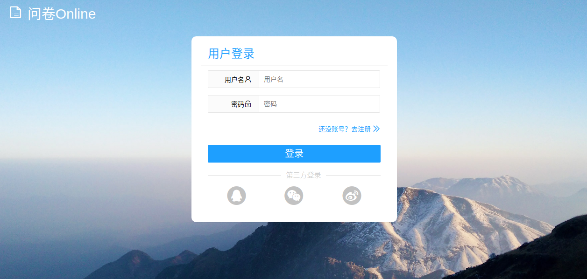
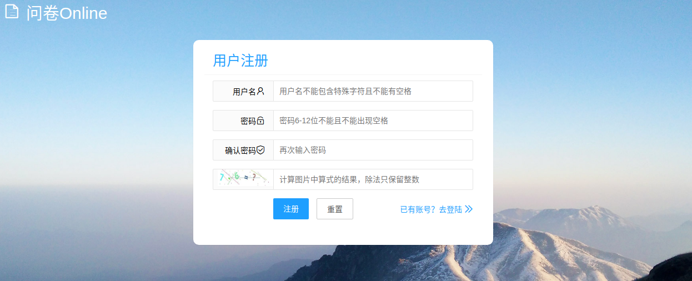

#### Homepage
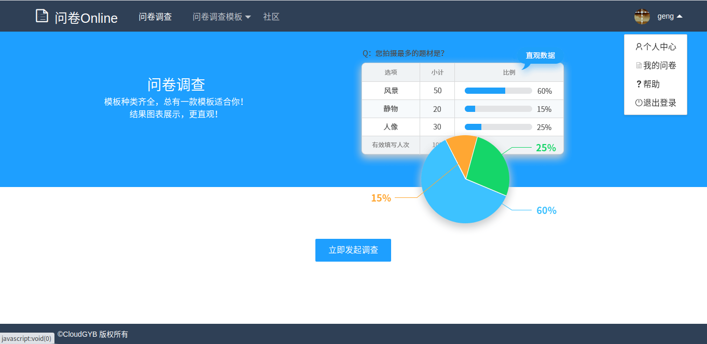

#### Survey Templates
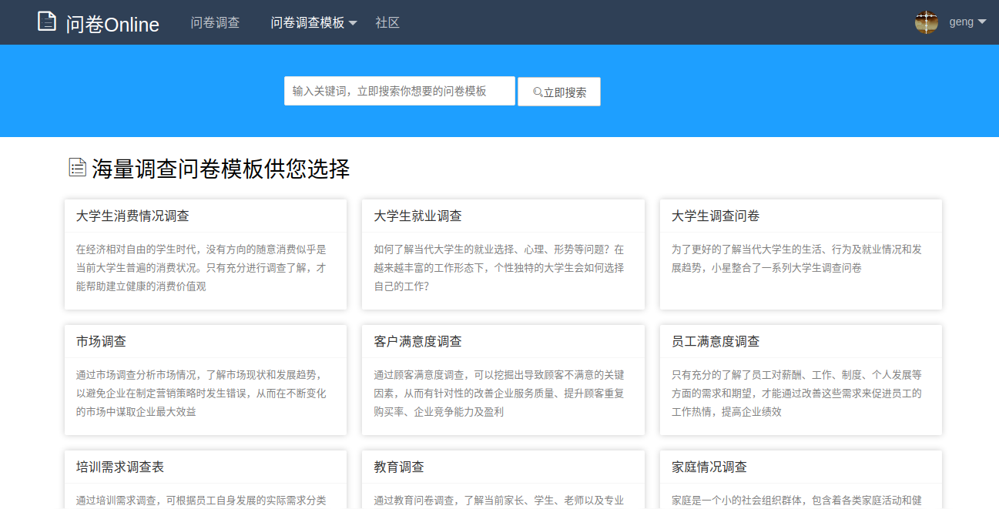
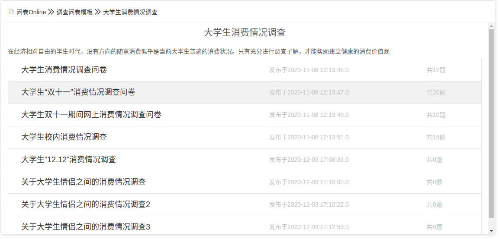

#### Template Preview
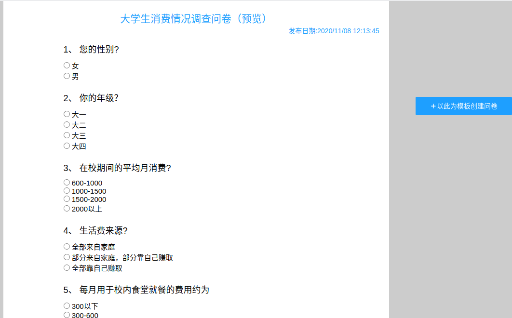

#### Create Questionnaire
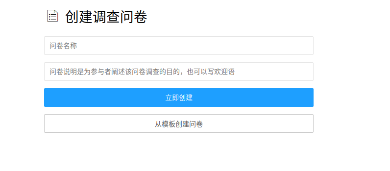

#### Questionnaire Design
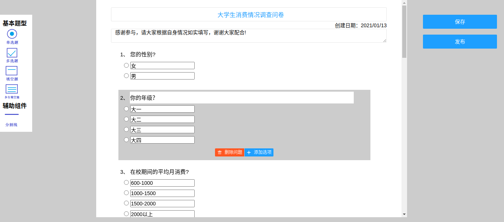

#### My Questionnaires
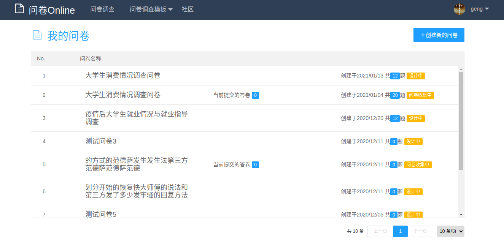

#### Share Questionnaire
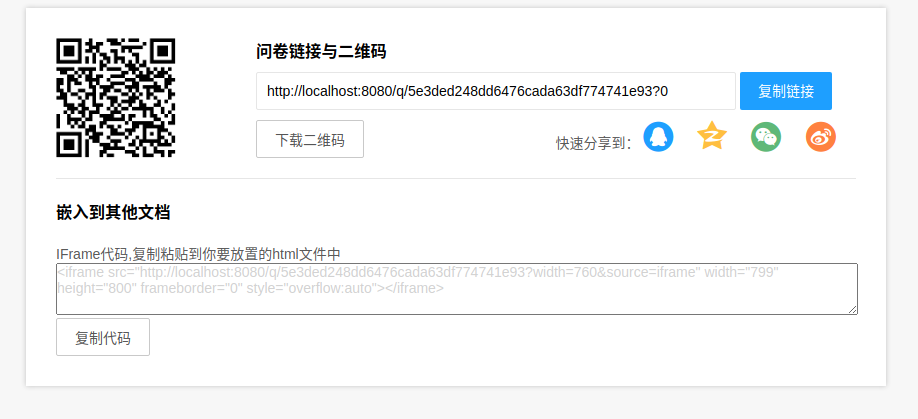

#### Questionnaire Report
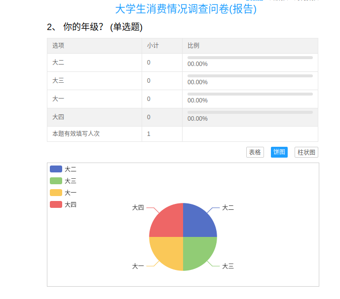

#### Personal Center
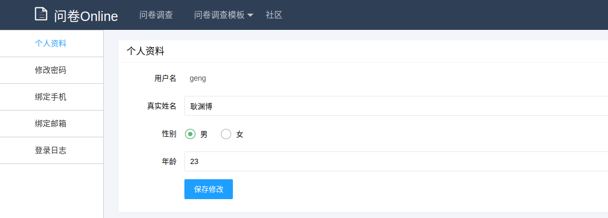# Questionnaire Survey Project - "QuestionnaireOnline"
An online questionnaire survey system based on Spring Boot, with primary features including login/registration, survey templates, questionnaire creation, online template editing, sharing on social media, result analysis and statistics (chart display), and a personal center.

A online questionnaire survey system based on Spring Boot.

### Technologies Used
* Development Language: JDK 11
* Web Framework: Spring Boot 2+, Thymeleaf
* Database: MySQL 5.5+
* Frontend Technologies: Layui, jQuery, jQuery UI
* Build Tool: Maven 3.5+

### Key Features
* Login/Registration
* User Center
* Create/Publish Questionnaires
* Quick Collection via Survey Sharing
* Result Analysis and Statistics
* Rich Variety of Survey Templates
* ... and more ...

### Database ER Diagram

### Run and Deployment Documentation
- [Local Run and Deployment Documentation](docs/RUN_DEPLOY.md)
- [Docker Deployment Documentation](docs/DOCKER_DEPLOY.md)

### Screenshots
#### Login/Registration

#### Homepage

#### Survey Templates

#### Template Preview

#### Create Questionnaire

#### Questionnaire Design

#### My Questionnaires

#### Share Questionnaire

#### Questionnaire Report

#### Personal Center

